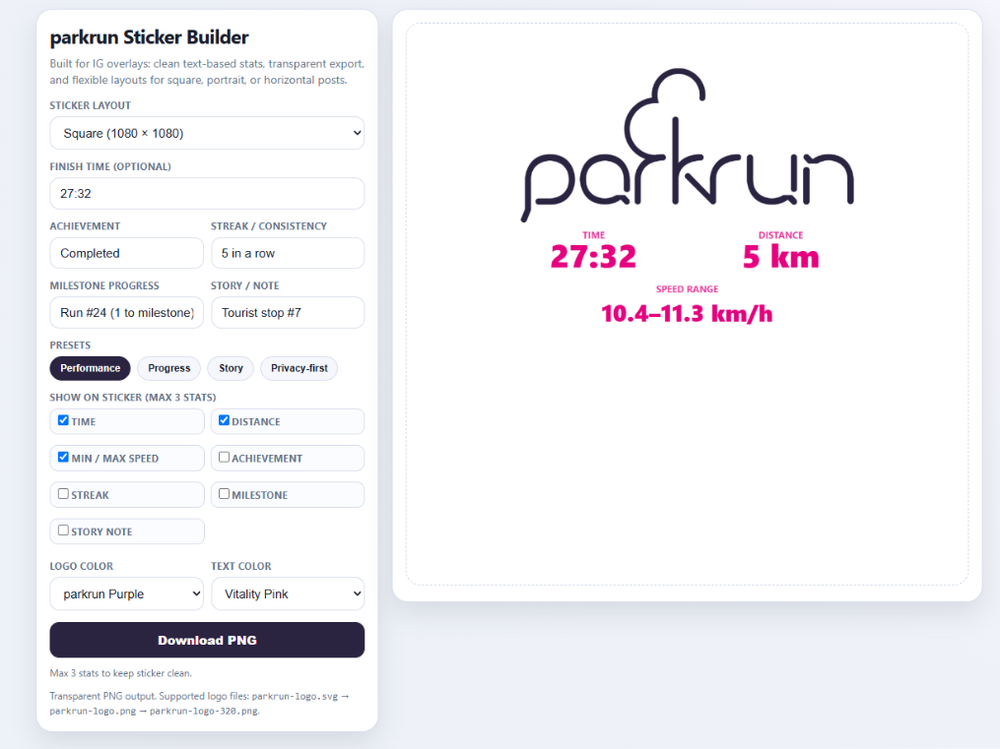

# 🏃 parkrun Sticker Builder

A lightweight, mobile-first web app that allows you to create custom, beautiful sticker overlays for your parkrun achievements. Similar to Strava's sharing features, this tool lets you generate clean stats to overlay on your Instagram stories, WhatsApp statuses, or other social media.

## ✨ Features

- **📱 True Mobile-First Experience:** Features a sticky preview canvas on mobile so you never lose sight of your sticker while editing settings. 
- **🌗 Dark Mode Support:** Automatically respects your device's system dark mode preference for a sleek, modern UI.
- **🚀 Native Mobile Sharing:** Uses the Web Share API on mobile devices to send the sticker straight to Instagram or your favorite app—no need to clutter your camera roll!
- **💾 Auto-Save:** Uses local storage to remember your layout, colors, and stat preferences so you don't have to re-enter them every week.
- **🖼️ Configurable Layouts & Backgrounds:** Choose from Square, Portrait (IG Story), or Horizontal. You can also pick between a purely Transparent background or a frosted "Solid Card" backing.
- **📊 Contextual, Customizable Stats:** 
  - Toggle stats on/off and watch the UI cleanly expand only the inputs you need. 
  - Support for **5k** or **2k (Junior parkrun)**.
  - Custom fields: Finish Time, Speed Range (auto-calculated), Achievement, Streak, Milestone, and Story Notes.
- **🎨 Color Themes:** Customize the logo and text colors to match the parkrun branding or your photo's aesthetic.

## 🚀 How to Use

1. Open `index.html` in your web browser.
2. Select your desired **Layout** and **Background**.
3. Toggle on up to 3 **Run Details** to show on your sticker. When you toggle a stat on, its text box will seamlessly appear!
4. Customize the **Logo color** and **Text color**.
5. Click **Share** (on supported mobile devices) to beam it straight to your social apps, or **Save PNG** to download it.
6. If downloading, simply open Instagram, load your photo, and paste/add the sticker PNG on top!

## 🛠️ Tech Stack

- **Zero dependencies!** Built purely with vanilla HTML, CSS, and JavaScript.
- Uses **HTML5 Canvas** for lightning-fast, on-device rendering.
- State-of-the-art CSS (Custom Properties, Grid, Flexbox, glassmorphism filters).

## 📁 Project Structure

- `index.html`: The main application file containing all the UI and logic.
- `parkrun-logo.*`: Logo assets used for generating the overlays.
- `docs/`: Additional documentation and assets.
